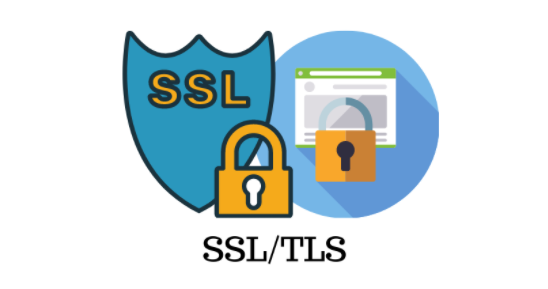

# ssl协议及工具学习




不加密的通信存在以下三种风险：

1. 窃听风险（eavesdropping）：第三方可以获知通信内容。
2. 篡改风险（tampering）：第三方可以修改通信内容。
3. 冒充风险（pretending）：第三方可以冒充他人身份参与通信。

SSL/TLS协议是为了解决这三大风险而设计的，希望达到：

1. 所有信息都是加密传播，第三方无法窃听。
2. 具有校验机制，一旦被篡改，通信双方会立刻发现。
3. 配备身份证书，防止身份被冒充。


## 本仓库内容

1. ssl协议及工具学习


```
Something I hope you know before go into the coding ~
First, please watch or star this repo, I'll be more happy if you follow me.
Bug report, questions and discussion are welcome, you can post an issue or pull a request.
```

## 相关站点

* RFC文档: <https://datatracker.ietf.org/doc/html/rfc5246>
* TLS完全指南: <https://github.com/k8sp/tls>


## 目录

* [SSL协议](docs/SSL协议.md)
* [TLS协议](docs/TLS协议.md)
* [openssl工具](docs/openssl工具.md)
    * [介绍](docs/openssl工具/介绍.md)
    * [安装](docs/openssl工具/安装.md)
    * [使用](docs/openssl工具/使用.md)


## 经典图示

---
