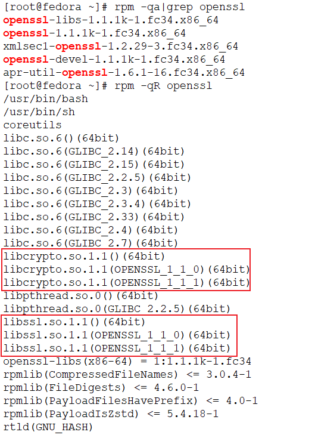

# 介绍


OpenSSL 是一个开源项目，其组成主要包括一下三个组件：

1. openssl：多用途的命令行工具
2. libcrypto：加密算法库
3. libssl：加密模块应用库，实现了ssl及tls

## Fedora 34 openssl安装



可以看到，三个组件openssl、libcrypto、libssl是相互依赖的

```
yum install -y openssl
```

## 二进制工具


* openssl: OpenSSL command line tool
* make-dummy-cert: 脚本
* renew-dummy-cert: 脚本


---
