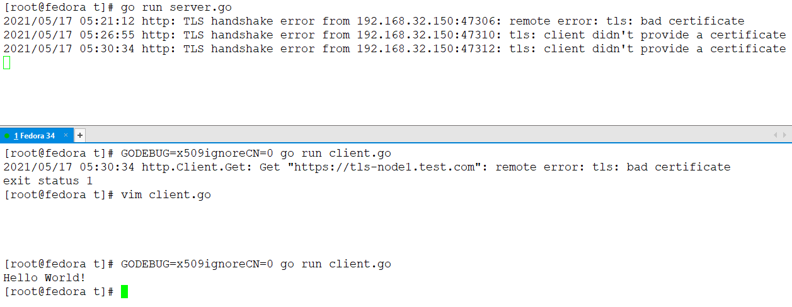

<!-- MDTOC maxdepth:6 firsth1:1 numbering:0 flatten:0 bullets:1 updateOnSave:1 -->

- [go双向验证](#go双向验证)   
   - [实验环境](#实验环境)   
   - [创建CA及服务端、客户端证书](#创建ca及服务端、客户端证书)   
   - [服务端代码](#服务端代码)   
   - [客户端代码](#客户端代码)   
   - [测试](#测试)   

<!-- /MDTOC -->

# go双向验证

## 实验环境

1. VMware 15
2. Fedora 34 虚拟机两台


/etc/hosts中添加两条记录

```
192.168.30.150  tls-node1.test.com
192.168.30.151  tls-node2.test.com
```

## 创建CA及服务端、客户端证书

1. 创建我们自己CA(Certificate authority)的私钥：

```
openssl genrsa -out ca.key 2048
```

2. 创建我们自己CA(Certificate authority)的CSR(Certificate Signing Request)，并且用自己的私钥自签署之，得到CA的身份证：

```
openssl req -x509 -new -nodes -key ca.key -days 10000 -out ca.crt -subj "/CN=we-as-ca"
```

3. 创建server的私钥，CSR(Certificate Signing Request)，并且用**CA的私钥ca.key**自签署server的身份证CRT(Certificate)：

```
openssl genrsa -out server.key 2048
openssl req -new -key server.key -out server.csr -subj "/CN=tls-node1.test.com"
openssl x509 -req -in server.csr -CA ca.crt -CAkey ca.key -CAcreateserial -out server.crt -days 365
```

其中CN(Common Name)必须与服务器端域名保持一致


4. 创建client的私钥，CSR(Certificate Signing Request)，以及用**CA的私钥ca.key**签署client的身份证CRT(Certificate)：

* 单向验证，客户端CN随便填

```
openssl genrsa -out client.key 2048
openssl req -new -key client.key -out client.csr -subj "/CN=randomfuckcn"
openssl x509 -req -in client.csr -CA ca.crt -CAkey ca.key -CAcreateserial -out client.crt -days 365
```


## 服务端代码

```
package main

import (
	"crypto/tls"
	"crypto/x509"
	"fmt"
	"io/ioutil"
	"log"
	"net/http"
)

func main() {
	s := &http.Server{
		Addr: ":443",
		Handler: http.HandlerFunc(func(w http.ResponseWriter, r *http.Request) {
			fmt.Fprintf(w, "Hello World!\n")
		}),
		TLSConfig: &tls.Config{
			ClientCAs:  loadCA("ca.crt"),
			ClientAuth: tls.RequireAndVerifyClientCert, // 验证客户端证书
		},
	}

	e := s.ListenAndServeTLS("server.crt", "server.key")
	if e != nil {
		log.Fatal("ListenAndServeTLS: ", e)
	}
}

func loadCA(caFile string) *x509.CertPool {
	pool := x509.NewCertPool()

	if ca, e := ioutil.ReadFile(caFile); e != nil {
		log.Fatal("ReadFile: ", e)
	} else {
		pool.AppendCertsFromPEM(ca)
	}
	return pool
}
```

## 客户端代码

```
package main

import (
	"crypto/tls"
	"crypto/x509"
	"io"
	"io/ioutil"
	"log"
	"net/http"
	"os"
)

func main() {
  // 加载证书
	pair, e := tls.LoadX509KeyPair("client.crt", "client.key")
	if e != nil {
		log.Fatal("LoadX509KeyPair:", e)
	}

	client := &http.Client{
		Transport: &http.Transport{
			TLSClientConfig: &tls.Config{
				RootCAs:      loadCA("ca.crt"),
				Certificates: []tls.Certificate{pair}, //客户端加载证书
			},
		}}

	resp, e := client.Get("https://tls-node1.test.com")
	if e != nil {
		log.Fatal("http.Client.Get: ", e)
	}
	defer resp.Body.Close()
	io.Copy(os.Stdout, resp.Body)
}

func loadCA(caFile string) *x509.CertPool {
	pool := x509.NewCertPool()

	if ca, e := ioutil.ReadFile(caFile); e != nil {
		log.Fatal("ReadFile: ", e)
	} else {
		pool.AppendCertsFromPEM(ca)
	}
	return pool
}
```

## 测试





---
